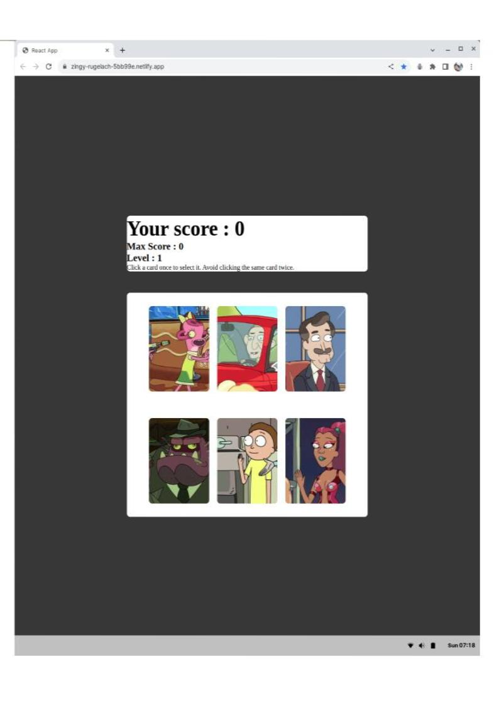

## The following project is the memory card project for the Odin Project course.

### Created a game that's accessible at
https://zingy-rugelach-5bb99e.netlify.app/

### I implemented some basic functionality that includes
Getting objects with images  from an API.
https://rickandmortyapi.com/

I'm using this array of objects in a **Deck** component that displays 6 cards using the images from the objects.

Clicking on the cards shuffles them using the Fisher-Yates algorithm, This is located in the helpers folder.

Clicking the same card twice shows a Modal with a  **Game-over message** This modal has a restart button.

When you restart, a new API request is made and the array of objects is shuffled.

If all the cards are clicked without repetition, a Modal appears. The Modal displays a congratulatory message and a button to proceed to the next level. The app then generates a new set of cards.

 The API call accepts an array of numbers representing character IDs for data retrieval. I use a function to generate a random array of numbers, which I then employ while fetching data to get random characters for each fetch request. The 'randomNumbersArray' function is found in the helpers folder.

 I display the level, current and maximum scores on the header component.

UI is responsive.

I used the use-sound hook to add sounds for card clicks and shuffling.

I’m using the react-card-flip hook to flip cards on click

### Things that I need to work on.

Originally, I had a main theme playing during the game. I intended to stop playing it when showing the modal, but if it played for a while, the music wouldn’t stop. So, I decided not to include it. 